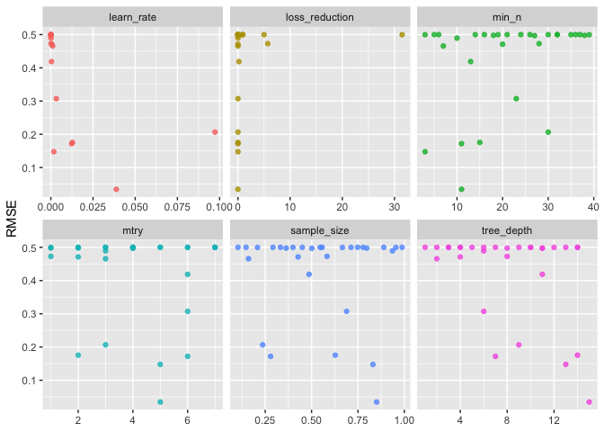

Extreme gradient boosted classification and regression trees to predict
outcomes in patients with monoclonal gammapathies of undermind
significance
================
Aheli Dutta, Jordan Gauthier

``` r
library(dplyr)
```

    ## 
    ## Attaching package: 'dplyr'

    ## The following objects are masked from 'package:stats':
    ## 
    ##     filter, lag

    ## The following objects are masked from 'package:base':
    ## 
    ##     intersect, setdiff, setequal, union

``` r
library("survival")
library("survminer")
```

    ## Loading required package: ggplot2

    ## Loading required package: ggpubr

``` r
library("gtsummary")
library(knitr)
library(tidyr)
library(xgboost)
```

    ## 
    ## Attaching package: 'xgboost'

    ## The following object is masked from 'package:dplyr':
    ## 
    ##     slice

``` r
library(tidymodels)
```

    ## ── Attaching packages ────────────────────────────────────── tidymodels 0.1.2 ──

    ## ✓ broom     0.7.4      ✓ recipes   0.1.15
    ## ✓ dials     0.0.9      ✓ rsample   0.0.9 
    ## ✓ infer     0.5.4      ✓ tibble    3.0.4 
    ## ✓ modeldata 0.1.0      ✓ tune      0.1.2 
    ## ✓ parsnip   0.1.5      ✓ workflows 0.2.1 
    ## ✓ purrr     0.3.4      ✓ yardstick 0.0.7

    ## ── Conflicts ───────────────────────────────────────── tidymodels_conflicts() ──
    ## x recipes::all_numeric() masks gtsummary::all_numeric()
    ## x purrr::discard()       masks scales::discard()
    ## x dplyr::filter()        masks stats::filter()
    ## x dplyr::lag()           masks stats::lag()
    ## x xgboost::slice()       masks dplyr::slice()
    ## x recipes::step()        masks stats::step()

``` r
library(mice)
```

    ## 
    ## Attaching package: 'mice'

    ## The following object is masked from 'package:stats':
    ## 
    ##     filter

    ## The following objects are masked from 'package:base':
    ## 
    ##     cbind, rbind

``` r
#library(haven)
```

\#data exploration

``` r
df_mgus <- survival::mgus2 %>% 
  dplyr::select(age,dxyr,hgb,creat,mspike,pstat)

sapply(df_mgus,sd)
```

    ##        age       dxyr        hgb      creat     mspike      pstat 
    ## 12.1721171  6.3738664         NA         NA         NA  0.2761217

``` r
#distribution of data
par(mfrow = c(2,3))
for( i in 1:5){
  hist(df_mgus[,i], main = colnames(df_mgus)[i],xlab = colnames(df_mgus)[i], col = 'light blue')
}

#box plots
par(mfrow = c(2,3))
```

<!-- -->

``` r
boxplot(mspike~pstat, ylab = "Monoclonal Serum Splike", xLab = "Progression to PCM", col = "light green", data = df_mgus)
boxplot(hgb~pstat, ylab = "Hemoglobin", xLab = "Progression to PCM", col = "light green", data = df_mgus)
boxplot(creat~pstat, ylab = "Creatinine", xLab = "Progression to PCM", col = "light green", data = df_mgus)
boxplot(age~pstat, ylab = "Age", xLab = "Progression to PCM", col = "light green", data = df_mgus)
boxplot(dxyr~pstat, ylab = "Year Diagnosed", xLab = "Progression to PCM", col = "light green", data = df_mgus)
```

<!-- -->

\#XGBoost Model

``` r
set.seed(123)
mgus_df <- complete(mice(mgus2, m=1, maxit = 50, method = 'pmm', seed = 500),1)
```

    ## 
    ##  iter imp variable
    ##   1   1  hgb  creat  mspike
    ##   2   1  hgb  creat  mspike
    ##   3   1  hgb  creat  mspike
    ##   4   1  hgb  creat  mspike
    ##   5   1  hgb  creat  mspike
    ##   6   1  hgb  creat  mspike
    ##   7   1  hgb  creat  mspike
    ##   8   1  hgb  creat  mspike
    ##   9   1  hgb  creat  mspike
    ##   10   1  hgb  creat  mspike
    ##   11   1  hgb  creat  mspike
    ##   12   1  hgb  creat  mspike
    ##   13   1  hgb  creat  mspike
    ##   14   1  hgb  creat  mspike
    ##   15   1  hgb  creat  mspike
    ##   16   1  hgb  creat  mspike
    ##   17   1  hgb  creat  mspike
    ##   18   1  hgb  creat  mspike
    ##   19   1  hgb  creat  mspike
    ##   20   1  hgb  creat  mspike
    ##   21   1  hgb  creat  mspike
    ##   22   1  hgb  creat  mspike
    ##   23   1  hgb  creat  mspike
    ##   24   1  hgb  creat  mspike
    ##   25   1  hgb  creat  mspike
    ##   26   1  hgb  creat  mspike
    ##   27   1  hgb  creat  mspike
    ##   28   1  hgb  creat  mspike
    ##   29   1  hgb  creat  mspike
    ##   30   1  hgb  creat  mspike
    ##   31   1  hgb  creat  mspike
    ##   32   1  hgb  creat  mspike
    ##   33   1  hgb  creat  mspike
    ##   34   1  hgb  creat  mspike
    ##   35   1  hgb  creat  mspike
    ##   36   1  hgb  creat  mspike
    ##   37   1  hgb  creat  mspike
    ##   38   1  hgb  creat  mspike
    ##   39   1  hgb  creat  mspike
    ##   40   1  hgb  creat  mspike
    ##   41   1  hgb  creat  mspike
    ##   42   1  hgb  creat  mspike
    ##   43   1  hgb  creat  mspike
    ##   44   1  hgb  creat  mspike
    ##   45   1  hgb  creat  mspike
    ##   46   1  hgb  creat  mspike
    ##   47   1  hgb  creat  mspike
    ##   48   1  hgb  creat  mspike
    ##   49   1  hgb  creat  mspike
    ##   50   1  hgb  creat  mspike

``` r
#mgusNew_df <- read.csv("mgus_custom_data.csv")

mgus_split <- mgus_df %>% 
  dplyr::select(-futime,-death,-id,-ptime) %>% 
  initial_split(., strata = pstat)
mgus_train <- read.csv("mgus_custom_data_train.csv") %>% 
  dplyr::select(-X,-Unnamed..0)
mgus_test <- testing(mgus_split)
```

``` r
xgb_spec <- boost_tree(
  trees = 1000,
  tree_depth = tune(), min_n = tune(), loss_reduction = tune(),
  sample_size = tune(), mtry = tune(), learn_rate = tune()
) %>%
  set_engine("xgboost", objective = 'binary:logistic') %>%
  set_mode('regression')

xgb_spec
```

    ## Boosted Tree Model Specification (regression)
    ## 
    ## Main Arguments:
    ##   mtry = tune()
    ##   trees = 1000
    ##   min_n = tune()
    ##   tree_depth = tune()
    ##   learn_rate = tune()
    ##   loss_reduction = tune()
    ##   sample_size = tune()
    ## 
    ## Engine-Specific Arguments:
    ##   objective = binary:logistic
    ## 
    ## Computational engine: xgboost

``` r
xgb_grid <- grid_latin_hypercube(
  tree_depth(),
  min_n(),
  loss_reduction(),
  sample_size = sample_prop(),
  finalize(mtry(), mgus_train),
  learn_rate(),
  size = 30
)

xgb_grid
```

    ## # A tibble: 30 x 6
    ##    tree_depth min_n loss_reduction sample_size  mtry learn_rate
    ##         <int> <int>          <dbl>       <dbl> <int>      <dbl>
    ##  1          9    30       3.08e-10       0.236     3   9.73e- 2
    ##  2         11    27       1.18e- 1       0.501     4   2.03e- 5
    ##  3         10    14       9.57e- 1       0.778     6   1.80e- 8
    ##  4          9    21       3.19e- 4       0.748     2   5.07e-10
    ##  5          6    10       1.06e- 9       0.936     3   7.80e- 5
    ##  6         12    39       3.15e+ 1       0.666     2   4.17e- 6
    ##  7         10     3       6.22e- 2       0.954     4   8.32e- 7
    ##  8         14     6       9.35e- 4       0.546     6   9.80e- 9
    ##  9          4    32       2.34e- 5       0.400     7   2.12e- 9
    ## 10          8    38       1.12e- 6       0.797     2   2.59e- 5
    ## # … with 20 more rows

``` r
xgb_wf <- workflow() %>%
  add_formula(pstat ~ .) %>%
  add_model(xgb_spec)
```

``` r
set.seed(123)
mgus_folds <- vfold_cv(mgus_train, strata = pstat)
mgus_folds
```

    ## #  10-fold cross-validation using stratification 
    ## # A tibble: 10 x 2
    ##    splits           id    
    ##    <list>           <chr> 
    ##  1 <split [9K/1K]>  Fold01
    ##  2 <split [9K/1K]>  Fold02
    ##  3 <split [9K/1K]>  Fold03
    ##  4 <split [9K/1K]>  Fold04
    ##  5 <split [9K/1K]>  Fold05
    ##  6 <split [9K/1K]>  Fold06
    ##  7 <split [9K/1K]>  Fold07
    ##  8 <split [9K/999]> Fold08
    ##  9 <split [9K/999]> Fold09
    ## 10 <split [9K/999]> Fold10

``` r
doParallel::registerDoParallel()

set.seed(234)
xgb_res <- tune_grid(
  xgb_wf,
  resamples = mgus_folds,
  grid = xgb_grid, 
  control = control_grid(save_pred = TRUE)
)
```

    ## 
    ## Attaching package: 'rlang'

    ## The following objects are masked from 'package:purrr':
    ## 
    ##     %@%, as_function, flatten, flatten_chr, flatten_dbl, flatten_int,
    ##     flatten_lgl, flatten_raw, invoke, list_along, modify, prepend,
    ##     splice

    ## 
    ## Attaching package: 'vctrs'

    ## The following object is masked from 'package:tibble':
    ## 
    ##     data_frame

    ## The following object is masked from 'package:dplyr':
    ## 
    ##     data_frame

``` r
xgb_res %>%
  collect_metrics() %>%
  dplyr::filter(.metric == "rmse") %>%
  dplyr::select(mean, mtry:sample_size) %>%
  pivot_longer(mtry:sample_size,
               values_to = "value",
               names_to = "parameter"
  ) %>%
  ggplot(aes(value, mean, color = parameter)) +
  geom_point(alpha = 0.8, show.legend = FALSE) +
  facet_wrap(~parameter, scales = "free_x") +
  labs(x = NULL, y = "RMSE")
```

<!-- -->

``` r
show_best(xgb_res, "rmse")
```

    ## # A tibble: 5 x 12
    ##    mtry min_n tree_depth learn_rate loss_reduction sample_size .metric
    ##   <int> <int>      <int>      <dbl>          <dbl>       <dbl> <chr>  
    ## 1     5    11         15    0.0388  0.0000000192         0.851 rmse   
    ## 2     5     3         13    0.00178 0.00000187           0.831 rmse   
    ## 3     6    11          7    0.0123  0.00000000376        0.279 rmse   
    ## 4     2    15         14    0.0128  0.0000000206         0.628 rmse   
    ## 5     3    30          9    0.0973  0.000000000308       0.236 rmse   
    ## # … with 5 more variables: .estimator <chr>, mean <dbl>, n <int>,
    ## #   std_err <dbl>, .config <chr>

``` r
best_rmse <- select_best(xgb_res, "rmse")
best_rmse
```

    ## # A tibble: 1 x 7
    ##    mtry min_n tree_depth learn_rate loss_reduction sample_size .config          
    ##   <int> <int>      <int>      <dbl>          <dbl>       <dbl> <chr>            
    ## 1     5    11         15     0.0388   0.0000000192       0.851 Preprocessor1_Mo…

``` r
final_xgb <- finalize_workflow(
  xgb_wf,
  best_rmse
)

final_xgb
```

    ## ══ Workflow ════════════════════════════════════════════════════════════════════
    ## Preprocessor: Formula
    ## Model: boost_tree()
    ## 
    ## ── Preprocessor ────────────────────────────────────────────────────────────────
    ## pstat ~ .
    ## 
    ## ── Model ───────────────────────────────────────────────────────────────────────
    ## Boosted Tree Model Specification (regression)
    ## 
    ## Main Arguments:
    ##   mtry = 5
    ##   trees = 1000
    ##   min_n = 11
    ##   tree_depth = 15
    ##   learn_rate = 0.0387988749361875
    ##   loss_reduction = 1.92076668696497e-08
    ##   sample_size = 0.850751234183554
    ## 
    ## Engine-Specific Arguments:
    ##   objective = binary:logistic
    ## 
    ## Computational engine: xgboost

``` r
library(vip)
```

    ## 
    ## Attaching package: 'vip'

    ## The following object is masked from 'package:utils':
    ## 
    ##     vi

``` r
final_xgb %>%
  fit(data = mgus_train) %>%
  pull_workflow_fit() %>%
  vip(geom = "point")
```

    ## [03:46:40] WARNING: amalgamation/../src/learner.cc:1061: Starting in XGBoost 1.3.0, the default evaluation metric used with the objective 'binary:logistic' was changed from 'error' to 'logloss'. Explicitly set eval_metric if you'd like to restore the old behavior.

<!-- -->

``` r
final_res <- last_fit(final_xgb, mgus_split)

collect_metrics(final_res)
```

    ## # A tibble: 2 x 4
    ##   .metric .estimator .estimate .config             
    ##   <chr>   <chr>          <dbl> <chr>               
    ## 1 rmse    standard      0.266  Preprocessor1_Model1
    ## 2 rsq     standard      0.0176 Preprocessor1_Model1

``` r
final_res %>%
  collect_predictions() %>%
  mutate(pstat = as.factor(pstat))      %>%
  roc_curve(pstat, .pred) %>%
  ggplot(aes(x = 1 - specificity, y = sensitivity)) +
  geom_line(size = 1.5, color = "midnightblue") +
  geom_abline(
    lty = 2, alpha = 0.5,
    color = "gray50",
    size = 1.2
  )
```

<!-- -->

``` r
#Visuals
library(runway)
final_res %>%
  collect_predictions() %>% 
  threshperf_plot(.,
                outcome = 'pstat',
                prediction = '.pred')
```

    ## Warning in max(ids, na.rm = TRUE): no non-missing arguments to max; returning -
    ## Inf
    
    ## Warning in max(ids, na.rm = TRUE): no non-missing arguments to max; returning -
    ## Inf

<!-- -->

``` r
final_res %>%
  collect_predictions() %>% 
  cal_plot(.,
         outcome = 'pstat', 
         prediction = '.pred',
         show_loess = TRUE)
```

    ## Warning: Ignoring unknown aesthetics: ymin, ymax

    ## `geom_smooth()` using formula 'y ~ x'

    ## Warning: Removed 1 rows containing missing values (geom_smooth).

    ## Warning: Removed 2 rows containing missing values (geom_bar).

<!-- -->

``` r
final_res %>%
  collect_predictions() %>% 
  roc_plot(., 
         outcome = 'pstat', 
         prediction = '.pred',
         ci = TRUE, 
         plot_title = 'Single ROC curve w/CI ribbon')
```

    ## Setting levels: control = 0, case = 1

    ## Setting direction: controls < cases

<!-- -->

\#regression model

``` r
set.seed(123)
mgus_df_lg <- complete(mice(mgus2, m=1, maxit = 50, method = 'pmm', seed = 500),1)
```

    ## 
    ##  iter imp variable
    ##   1   1  hgb  creat  mspike
    ##   2   1  hgb  creat  mspike
    ##   3   1  hgb  creat  mspike
    ##   4   1  hgb  creat  mspike
    ##   5   1  hgb  creat  mspike
    ##   6   1  hgb  creat  mspike
    ##   7   1  hgb  creat  mspike
    ##   8   1  hgb  creat  mspike
    ##   9   1  hgb  creat  mspike
    ##   10   1  hgb  creat  mspike
    ##   11   1  hgb  creat  mspike
    ##   12   1  hgb  creat  mspike
    ##   13   1  hgb  creat  mspike
    ##   14   1  hgb  creat  mspike
    ##   15   1  hgb  creat  mspike
    ##   16   1  hgb  creat  mspike
    ##   17   1  hgb  creat  mspike
    ##   18   1  hgb  creat  mspike
    ##   19   1  hgb  creat  mspike
    ##   20   1  hgb  creat  mspike
    ##   21   1  hgb  creat  mspike
    ##   22   1  hgb  creat  mspike
    ##   23   1  hgb  creat  mspike
    ##   24   1  hgb  creat  mspike
    ##   25   1  hgb  creat  mspike
    ##   26   1  hgb  creat  mspike
    ##   27   1  hgb  creat  mspike
    ##   28   1  hgb  creat  mspike
    ##   29   1  hgb  creat  mspike
    ##   30   1  hgb  creat  mspike
    ##   31   1  hgb  creat  mspike
    ##   32   1  hgb  creat  mspike
    ##   33   1  hgb  creat  mspike
    ##   34   1  hgb  creat  mspike
    ##   35   1  hgb  creat  mspike
    ##   36   1  hgb  creat  mspike
    ##   37   1  hgb  creat  mspike
    ##   38   1  hgb  creat  mspike
    ##   39   1  hgb  creat  mspike
    ##   40   1  hgb  creat  mspike
    ##   41   1  hgb  creat  mspike
    ##   42   1  hgb  creat  mspike
    ##   43   1  hgb  creat  mspike
    ##   44   1  hgb  creat  mspike
    ##   45   1  hgb  creat  mspike
    ##   46   1  hgb  creat  mspike
    ##   47   1  hgb  creat  mspike
    ##   48   1  hgb  creat  mspike
    ##   49   1  hgb  creat  mspike
    ##   50   1  hgb  creat  mspike

``` r
mgus_split_lg <- mgus_df_lg %>% 
  dplyr::select(-futime,-death,-id,-ptime) %>% 
  initial_split(., strata = pstat)
mgus_train_lg <- read.csv("mgus_custom_data_glm.csv") %>% 
  dplyr::select(-X,-Unnamed..0)
mgus_test_lg <- testing(mgus_split)

lg.train <- mgus_train_lg
lg.test <- mgus_test_lg
```

``` r
library(pROC)
```

    ## Type 'citation("pROC")' for a citation.

    ## 
    ## Attaching package: 'pROC'

    ## The following objects are masked from 'package:stats':
    ## 
    ##     cov, smooth, var

``` r
library(runway)
model <- glm(pstat~ sex+ age + hgb+ mspike + dxyr + creat, data = lg.train, family = "binomial",control = list(maxit = 100 ))
prob <- predict(model, lg.test, type = "response")

predicted.outcomes <- prob
print(predicted.outcomes)
```

    ##          2          4          6          9         12         19         29 
    ## 0.77200580 0.47611079 0.16088389 0.66008068 0.39090349 0.58442993 0.27578205 
    ##         30         41         48         51         55         58         59 
    ## 0.62778422 0.19836140 0.87014266 0.17550329 0.90486944 0.32389092 0.46248554 
    ##         60         61         62         69         70         85         90 
    ## 0.26515456 0.38876809 0.59000930 0.53028105 0.35644607 0.35735295 0.61615014 
    ##         92         93        102        103        104        105        106 
    ## 0.49612590 0.45955794 0.63468336 0.45623948 0.41679192 0.62362213 0.32445430 
    ##        114        115        117        119        124        127        132 
    ## 0.80256359 0.55254194 0.74071843 0.50237578 0.61655791 0.50073355 0.43600031 
    ##        135        139        143        144        145        148        150 
    ## 0.53551279 0.45084685 0.20953352 0.22684850 0.29979413 0.23669781 0.34571858 
    ##        157        170        176        182        184        188        194 
    ## 0.17546574 0.48602790 0.38283746 0.62171966 0.68497755 0.70153830 0.20762901 
    ##        197        200        203        204        205        206        211 
    ## 0.41065882 0.62186840 0.63862013 0.27132795 0.19489195 0.63771976 0.21090963 
    ##        222        228        237        238        244        249        255 
    ## 0.39753413 0.26968561 0.27896921 0.20805401 0.52288745 0.25103887 0.25642648 
    ##        260        263        266        269        271        274        295 
    ## 0.20390587 0.56841588 0.56780937 0.46953239 0.49915255 0.53857242 0.62439545 
    ##        296        297        298        305        309        315        321 
    ## 0.33363674 0.55547283 0.70028700 0.53044753 0.39358226 0.35843883 0.61676562 
    ##        327        332        334        335        341        342        349 
    ## 0.39990303 0.86015462 0.53267063 0.67573401 0.35425406 0.56808162 0.63013831 
    ##        364        367        372        379        380        387        389 
    ## 0.43247289 0.54022233 0.41481348 0.48981911 0.46569545 0.37672089 0.42786269 
    ##        391        392        395        398        401        404        408 
    ## 0.39852736 0.58304569 0.25234613 0.47471883 0.51142830 0.26007568 0.21848214 
    ##        410        413        417        418        419        423        434 
    ## 0.58730085 0.59174528 0.64633215 0.30767805 0.39517930 0.36323000 0.34472721 
    ##        442        444        447        449        450        454        458 
    ## 0.28808302 0.61779854 0.13256240 0.28543380 0.35986380 0.40223351 0.25279104 
    ##        470        472        482        485        491        492        495 
    ## 0.26439181 0.44879864 0.25197730 0.53292375 0.29466117 0.76684546 0.50999279 
    ##        499        501        514        515        520        521        524 
    ## 0.15624719 0.19093787 0.52541331 0.30415275 0.41729336 0.49034320 0.76777182 
    ##        525        530        541        544        545        546        554 
    ## 0.54489301 0.28462481 0.42805277 0.35147625 0.52917038 0.92746226 0.45822354 
    ##        559        562        563        565        570        572        573 
    ## 0.63861621 0.35815694 0.61095090 0.47601826 0.27136113 0.26406104 0.21840988 
    ##        579        582        583        587        589        594        604 
    ## 0.29356111 0.48055742 0.24032149 0.45118008 0.56811721 0.44356771 0.66147700 
    ##        634        636        640        645        650        653        657 
    ## 0.45626849 0.69093860 0.39257210 0.50882021 0.62902854 0.46065936 0.31388814 
    ##        661        669        678        680        682        687        688 
    ## 0.65453895 0.51642032 0.57694358 0.28628315 0.09939539 0.62540250 0.12180692 
    ##        689        695        698        701        702        704        705 
    ## 0.41200527 0.21645484 0.49329679 0.23201176 0.31801804 0.58914743 0.65921190 
    ##        707        709        711        716        722        723        737 
    ## 0.14275533 0.54347052 0.65603236 0.61194536 0.53361131 0.48478673 0.19245436 
    ##        739        740        745        748        750        754        762 
    ## 0.67381199 0.21099020 0.31481787 0.19078341 0.40152555 0.38190595 0.43335154 
    ##        773        785        798        800        802        804        810 
    ## 0.51699534 0.35967219 0.35652510 0.30972873 0.41131423 0.64299898 0.28647137 
    ##        815        818        826        843        844        845        846 
    ## 0.18819554 0.32586631 0.46476002 0.56532540 0.47568229 0.48300480 0.54357837 
    ##        854        856        859        861        873        876        882 
    ## 0.50447272 0.40912629 0.25638245 0.16746551 0.39383849 0.17601239 0.22668121 
    ##        885        887        888        897        898        902        903 
    ## 0.26638766 0.18072798 0.74328028 0.65639851 0.28653413 0.81608247 0.42106225 
    ##        904        911        918        919        922        923        929 
    ## 0.37754292 0.16438588 0.16686712 0.47819663 0.42608990 0.43958092 0.46513467 
    ##        933        940        941        944        948        952        955 
    ## 0.37681614 0.53688285 0.36532181 0.35788774 0.37118431 0.76823334 0.18837574 
    ##        962        963        965        966        974        978        979 
    ## 0.51040729 0.43292782 0.63640570 0.84615996 0.40416484 0.32430918 0.21624811 
    ##        983        984        985        991        995       1002       1008 
    ## 0.73689594 0.20368401 0.47290419 0.64753730 0.20987926 0.25791169 0.74387341 
    ##       1010       1012       1017       1018       1020       1023       1026 
    ## 0.30224584 0.71356674 0.29474316 0.56657531 0.41850661 0.76986342 0.52358621 
    ##       1031       1032       1034       1036       1038       1041       1043 
    ## 0.38551217 0.51348071 0.46809030 0.49031555 0.39239611 0.60883412 0.43858980 
    ##       1044       1054       1055       1057       1060       1061       1071 
    ## 0.32995495 0.69847771 0.40230994 0.03192571 0.57033688 0.71983312 0.45485973 
    ##       1073       1075       1101       1106       1109       1112       1121 
    ## 0.83869444 0.40669202 0.41206426 0.49958252 0.72611479 0.58127690 0.47503382 
    ##       1129       1130       1133       1138       1139       1142       1144 
    ## 0.74162357 0.50428327 0.33545298 0.48842519 0.62604838 0.42126215 0.24157517 
    ##       1148       1153       1155       1160       1161       1166       1169 
    ## 0.61393962 0.30928466 0.45800333 0.54364623 0.56530087 0.14874394 0.24074370 
    ##       1173       1174       1175       1178       1180       1186       1187 
    ## 0.63285519 0.32533856 0.56178118 0.57048976 0.51917846 0.34489161 0.19652876 
    ##       1189       1190       1193       1195       1197       1203       1213 
    ## 0.20041957 0.48695211 0.46484843 0.83369000 0.34300217 0.41018568 0.67907988 
    ##       1220       1224       1233       1236       1239       1240       1244 
    ## 0.47212339 0.61443011 0.46639674 0.38965047 0.50118208 0.46748693 0.45068423 
    ##       1246       1249       1250       1252       1253       1255       1259 
    ## 0.25743197 0.28368557 0.37089573 0.36012095 0.67147856 0.32856659 0.03276565 
    ##       1264       1265       1266       1268       1270       1271       1276 
    ## 0.42366153 0.24284894 0.44066503 0.46099934 0.26261191 0.20958658 0.69012139 
    ##       1278       1281       1292       1297       1302       1310       1315 
    ## 0.68964898 0.36090785 0.53923945 0.60364589 0.43184317 0.62574674 0.18899485 
    ##       1316       1317       1321       1325       1328       1329       1330 
    ## 0.36142454 0.52661525 0.17123316 0.09160901 0.15746504 0.43578753 0.32209088 
    ##       1335       1339       1344       1347       1348       1349       1354 
    ## 0.74921179 0.20096773 0.48282947 0.45010592 0.41228405 0.31064085 0.19905315 
    ##       1355       1358       1362       1364       1368       1374       1375 
    ## 0.55747394 0.37652033 0.72826768 0.48778988 0.41824410 0.22864655 0.31176048 
    ##       1378       1379       1380 
    ## 0.25093221 0.17551975 0.12505931

``` r
lg.test$prediction = predicted.outcomes

    
lg.test %>% roc_plot(
         outcome = 'pstat',
         prediction = 'prediction',
         ci = TRUE, 
         plot_title= 'Single ROC curve w/CI ribbon')
```

    ## Setting levels: control = 0, case = 1

    ## Setting direction: controls < cases

<!-- -->

``` r
lg.test %>%
  threshperf_plot(
                outcome = 'pstat',
                prediction = 'prediction')
```

    ## Warning in max(ids, na.rm = TRUE): no non-missing arguments to max; returning -
    ## Inf
    
    ## Warning in max(ids, na.rm = TRUE): no non-missing arguments to max; returning -
    ## Inf

<!-- -->

``` r
lg.test %>%
  cal_plot(
         outcome = 'pstat', 
         prediction = 'prediction',
         show_loess = TRUE)
```

    ## Warning: Ignoring unknown aesthetics: ymin, ymax

    ## `geom_smooth()` using formula 'y ~ x'

    ## Warning: Removed 2 rows containing missing values (geom_bar).

<!-- -->
