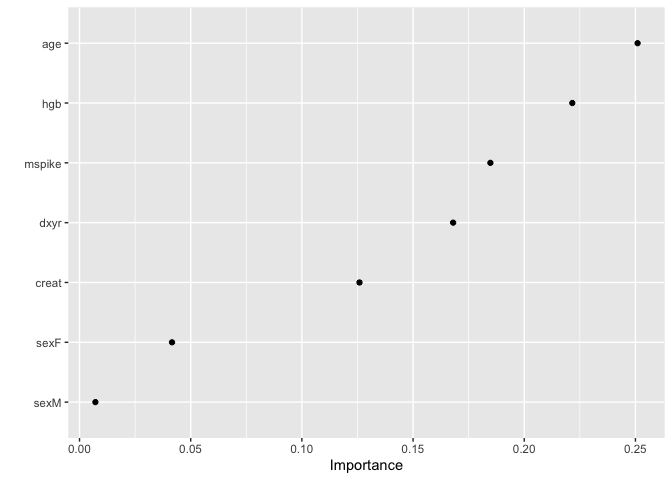
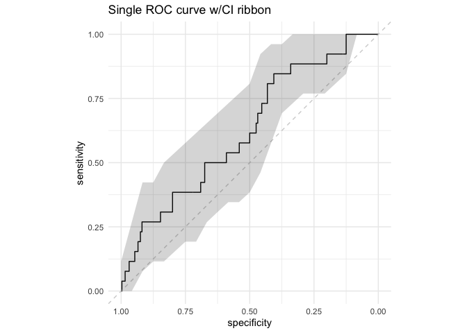
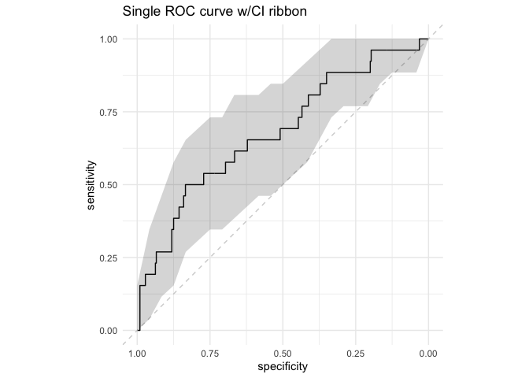

Extreme gradient boosted classification and regression trees to predict
outcomes in patients with monoclonal gammapathies of undermind
significance
================
Aheli Dutta, Jordan Gauthier

``` r
library(dplyr)
```

    ## 
    ## Attaching package: 'dplyr'

    ## The following objects are masked from 'package:stats':
    ## 
    ##     filter, lag

    ## The following objects are masked from 'package:base':
    ## 
    ##     intersect, setdiff, setequal, union

``` r
library("survival")
library("survminer")
```

    ## Loading required package: ggplot2

    ## Loading required package: ggpubr

``` r
library("gtsummary")
library(knitr)
library(tidyr)
library(xgboost)
```

    ## 
    ## Attaching package: 'xgboost'

    ## The following object is masked from 'package:dplyr':
    ## 
    ##     slice

``` r
library(tidymodels)
```

    ## ── Attaching packages ────────────────────────────────────── tidymodels 0.1.2 ──

    ## ✓ broom     0.7.4      ✓ recipes   0.1.15
    ## ✓ dials     0.0.9      ✓ rsample   0.0.9 
    ## ✓ infer     0.5.4      ✓ tibble    3.0.4 
    ## ✓ modeldata 0.1.0      ✓ tune      0.1.2 
    ## ✓ parsnip   0.1.5      ✓ workflows 0.2.1 
    ## ✓ purrr     0.3.4      ✓ yardstick 0.0.7

    ## ── Conflicts ───────────────────────────────────────── tidymodels_conflicts() ──
    ## x recipes::all_numeric() masks gtsummary::all_numeric()
    ## x purrr::discard()       masks scales::discard()
    ## x dplyr::filter()        masks stats::filter()
    ## x dplyr::lag()           masks stats::lag()
    ## x xgboost::slice()       masks dplyr::slice()
    ## x recipes::step()        masks stats::step()

``` r
library(mice)
```

    ## 
    ## Attaching package: 'mice'

    ## The following object is masked from 'package:stats':
    ## 
    ##     filter

    ## The following objects are masked from 'package:base':
    ## 
    ##     cbind, rbind

``` r
#library(haven)
```

\#data exploration

``` r
df_mgus <- survival::mgus2 %>% 
  dplyr::select(age,dxyr,hgb,creat,mspike,pstat)

sapply(df_mgus,sd)
```

    ##        age       dxyr        hgb      creat     mspike      pstat 
    ## 12.1721171  6.3738664         NA         NA         NA  0.2761217

``` r
#distribution of data
par(mfrow = c(2,3))
for( i in 1:5){
  hist(df_mgus[,i], main = colnames(df_mgus)[i],xlab = colnames(df_mgus)[i], col = 'light blue')
}

#box plots
par(mfrow = c(2,3))
```

<!-- -->

``` r
boxplot(mspike~pstat, ylab = "Monoclonal Serum Splike", xLab = "Progression to PCM", col = "light green", data = df_mgus)
boxplot(hgb~pstat, ylab = "Hemoglobin", xLab = "Progression to PCM", col = "light green", data = df_mgus)
boxplot(creat~pstat, ylab = "Creatinine", xLab = "Progression to PCM", col = "light green", data = df_mgus)
boxplot(age~pstat, ylab = "Age", xLab = "Progression to PCM", col = "light green", data = df_mgus)
boxplot(dxyr~pstat, ylab = "Year Diagnosed", xLab = "Progression to PCM", col = "light green", data = df_mgus)
```

<!-- -->

\#XGBoost Model

``` r
set.seed(123)
mgus_df <- complete(mice(mgus2, m=1, maxit = 50, method = 'pmm', seed = 500),1)
```

    ## 
    ##  iter imp variable
    ##   1   1  hgb  creat  mspike
    ##   2   1  hgb  creat  mspike
    ##   3   1  hgb  creat  mspike
    ##   4   1  hgb  creat  mspike
    ##   5   1  hgb  creat  mspike
    ##   6   1  hgb  creat  mspike
    ##   7   1  hgb  creat  mspike
    ##   8   1  hgb  creat  mspike
    ##   9   1  hgb  creat  mspike
    ##   10   1  hgb  creat  mspike
    ##   11   1  hgb  creat  mspike
    ##   12   1  hgb  creat  mspike
    ##   13   1  hgb  creat  mspike
    ##   14   1  hgb  creat  mspike
    ##   15   1  hgb  creat  mspike
    ##   16   1  hgb  creat  mspike
    ##   17   1  hgb  creat  mspike
    ##   18   1  hgb  creat  mspike
    ##   19   1  hgb  creat  mspike
    ##   20   1  hgb  creat  mspike
    ##   21   1  hgb  creat  mspike
    ##   22   1  hgb  creat  mspike
    ##   23   1  hgb  creat  mspike
    ##   24   1  hgb  creat  mspike
    ##   25   1  hgb  creat  mspike
    ##   26   1  hgb  creat  mspike
    ##   27   1  hgb  creat  mspike
    ##   28   1  hgb  creat  mspike
    ##   29   1  hgb  creat  mspike
    ##   30   1  hgb  creat  mspike
    ##   31   1  hgb  creat  mspike
    ##   32   1  hgb  creat  mspike
    ##   33   1  hgb  creat  mspike
    ##   34   1  hgb  creat  mspike
    ##   35   1  hgb  creat  mspike
    ##   36   1  hgb  creat  mspike
    ##   37   1  hgb  creat  mspike
    ##   38   1  hgb  creat  mspike
    ##   39   1  hgb  creat  mspike
    ##   40   1  hgb  creat  mspike
    ##   41   1  hgb  creat  mspike
    ##   42   1  hgb  creat  mspike
    ##   43   1  hgb  creat  mspike
    ##   44   1  hgb  creat  mspike
    ##   45   1  hgb  creat  mspike
    ##   46   1  hgb  creat  mspike
    ##   47   1  hgb  creat  mspike
    ##   48   1  hgb  creat  mspike
    ##   49   1  hgb  creat  mspike
    ##   50   1  hgb  creat  mspike

``` r
#mgusNew_df <- read.csv("mgus_custom_data.csv")

mgus_split <- mgus_df %>% 
  dplyr::select(-futime,-death,-id,-ptime) %>% 
  initial_split(., strata = pstat)
mgus_train <- read.csv("mgus_custom_data_train.csv") %>% 
  dplyr::select(-X,-Unnamed..0)
mgus_test <- testing(mgus_split)
```

``` r
xgb_spec <- boost_tree(
  trees = 1000,
  tree_depth = tune(), min_n = tune(), loss_reduction = tune(),
  sample_size = tune(), mtry = tune(), learn_rate = tune()
) %>%
  set_engine("xgboost", objective = 'binary:logistic') %>%
  set_mode('regression')

xgb_spec
```

    ## Boosted Tree Model Specification (regression)
    ## 
    ## Main Arguments:
    ##   mtry = tune()
    ##   trees = 1000
    ##   min_n = tune()
    ##   tree_depth = tune()
    ##   learn_rate = tune()
    ##   loss_reduction = tune()
    ##   sample_size = tune()
    ## 
    ## Engine-Specific Arguments:
    ##   objective = binary:logistic
    ## 
    ## Computational engine: xgboost

``` r
xgb_grid <- grid_latin_hypercube(
  tree_depth(),
  min_n(),
  loss_reduction(),
  sample_size = sample_prop(),
  finalize(mtry(), mgus_train),
  learn_rate(),
  size = 30
)

xgb_grid
```

    ## # A tibble: 30 x 6
    ##    tree_depth min_n loss_reduction sample_size  mtry learn_rate
    ##         <int> <int>          <dbl>       <dbl> <int>      <dbl>
    ##  1          9    30       3.08e-10       0.236     3   9.73e- 2
    ##  2         11    27       1.18e- 1       0.501     4   2.03e- 5
    ##  3         10    14       9.57e- 1       0.778     6   1.80e- 8
    ##  4          9    21       3.19e- 4       0.748     2   5.07e-10
    ##  5          6    10       1.06e- 9       0.936     3   7.80e- 5
    ##  6         12    39       3.15e+ 1       0.666     2   4.17e- 6
    ##  7         10     3       6.22e- 2       0.954     4   8.32e- 7
    ##  8         14     6       9.35e- 4       0.546     6   9.80e- 9
    ##  9          4    32       2.34e- 5       0.400     7   2.12e- 9
    ## 10          8    38       1.12e- 6       0.797     2   2.59e- 5
    ## # … with 20 more rows

``` r
xgb_wf <- workflow() %>%
  add_formula(pstat ~ .) %>%
  add_model(xgb_spec)
```

``` r
set.seed(123)
mgus_folds <- vfold_cv(mgus_train, strata = pstat)
mgus_folds
```

    ## #  10-fold cross-validation using stratification 
    ## # A tibble: 10 x 2
    ##    splits             id    
    ##    <list>             <chr> 
    ##  1 <split [2.7K/300]> Fold01
    ##  2 <split [2.7K/300]> Fold02
    ##  3 <split [2.7K/300]> Fold03
    ##  4 <split [2.7K/300]> Fold04
    ##  5 <split [2.7K/300]> Fold05
    ##  6 <split [2.7K/300]> Fold06
    ##  7 <split [2.7K/300]> Fold07
    ##  8 <split [2.7K/300]> Fold08
    ##  9 <split [2.7K/300]> Fold09
    ## 10 <split [2.7K/300]> Fold10

``` r
doParallel::registerDoParallel()

set.seed(234)
xgb_res <- tune_grid(
  xgb_wf,
  resamples = mgus_folds,
  grid = xgb_grid, 
  control = control_grid(save_pred = TRUE)
)
```

    ## 
    ## Attaching package: 'rlang'

    ## The following objects are masked from 'package:purrr':
    ## 
    ##     %@%, as_function, flatten, flatten_chr, flatten_dbl, flatten_int,
    ##     flatten_lgl, flatten_raw, invoke, list_along, modify, prepend,
    ##     splice

    ## 
    ## Attaching package: 'vctrs'

    ## The following object is masked from 'package:tibble':
    ## 
    ##     data_frame

    ## The following object is masked from 'package:dplyr':
    ## 
    ##     data_frame

``` r
xgb_res %>%
  collect_metrics() %>%
  dplyr::filter(.metric == "rmse") %>%
  dplyr::select(mean, mtry:sample_size) %>%
  pivot_longer(mtry:sample_size,
               values_to = "value",
               names_to = "parameter"
  ) %>%
  ggplot(aes(value, mean, color = parameter)) +
  geom_point(alpha = 0.8, show.legend = FALSE) +
  facet_wrap(~parameter, scales = "free_x") +
  labs(x = NULL, y = "RMSE")
```

<!-- -->

``` r
show_best(xgb_res, "rmse")
```

    ## # A tibble: 5 x 12
    ##    mtry min_n tree_depth learn_rate loss_reduction sample_size .metric
    ##   <int> <int>      <int>      <dbl>          <dbl>       <dbl> <chr>  
    ## 1     5    11         15    0.0388   0.0000000192        0.851 rmse   
    ## 2     5     3         13    0.00178  0.00000187          0.831 rmse   
    ## 3     6    11          7    0.0123   0.00000000376       0.279 rmse   
    ## 4     2    15         14    0.0128   0.0000000206        0.628 rmse   
    ## 5     6    23          6    0.00321  0.0000120           0.689 rmse   
    ## # … with 5 more variables: .estimator <chr>, mean <dbl>, n <int>,
    ## #   std_err <dbl>, .config <chr>

``` r
best_rmse <- select_best(xgb_res, "rmse")
best_rmse
```

    ## # A tibble: 1 x 7
    ##    mtry min_n tree_depth learn_rate loss_reduction sample_size .config          
    ##   <int> <int>      <int>      <dbl>          <dbl>       <dbl> <chr>            
    ## 1     5    11         15     0.0388   0.0000000192       0.851 Preprocessor1_Mo…

``` r
final_xgb <- finalize_workflow(
  xgb_wf,
  best_rmse
)

final_xgb
```

    ## ══ Workflow ════════════════════════════════════════════════════════════════════
    ## Preprocessor: Formula
    ## Model: boost_tree()
    ## 
    ## ── Preprocessor ────────────────────────────────────────────────────────────────
    ## pstat ~ .
    ## 
    ## ── Model ───────────────────────────────────────────────────────────────────────
    ## Boosted Tree Model Specification (regression)
    ## 
    ## Main Arguments:
    ##   mtry = 5
    ##   trees = 1000
    ##   min_n = 11
    ##   tree_depth = 15
    ##   learn_rate = 0.0387988749361875
    ##   loss_reduction = 1.92076668696497e-08
    ##   sample_size = 0.850751234183554
    ## 
    ## Engine-Specific Arguments:
    ##   objective = binary:logistic
    ## 
    ## Computational engine: xgboost

``` r
library(vip)
```

    ## 
    ## Attaching package: 'vip'

    ## The following object is masked from 'package:utils':
    ## 
    ##     vi

``` r
final_xgb %>%
  fit(data = mgus_train) %>%
  pull_workflow_fit() %>%
  vip(geom = "point")
```

    ## [03:20:33] WARNING: amalgamation/../src/learner.cc:1061: Starting in XGBoost 1.3.0, the default evaluation metric used with the objective 'binary:logistic' was changed from 'error' to 'logloss'. Explicitly set eval_metric if you'd like to restore the old behavior.

<!-- -->

``` r
final_res <- last_fit(final_xgb, mgus_split)

collect_metrics(final_res)
```

    ## # A tibble: 2 x 4
    ##   .metric .estimator .estimate .config             
    ##   <chr>   <chr>          <dbl> <chr>               
    ## 1 rmse    standard      0.264  Preprocessor1_Model1
    ## 2 rsq     standard      0.0227 Preprocessor1_Model1

``` r
final_res %>%
  collect_predictions() %>%
  mutate(pstat = as.factor(pstat))      %>%
  roc_curve(pstat, .pred) %>%
  ggplot(aes(x = 1 - specificity, y = sensitivity)) +
  geom_line(size = 1.5, color = "midnightblue") +
  geom_abline(
    lty = 2, alpha = 0.5,
    color = "gray50",
    size = 1.2
  )
```

<!-- -->

``` r
#Visuals
library(runway)
final_res %>%
  collect_predictions() %>% 
  threshperf_plot(.,
                outcome = 'pstat',
                prediction = '.pred')
```

    ## Warning in max(ids, na.rm = TRUE): no non-missing arguments to max; returning -
    ## Inf
    
    ## Warning in max(ids, na.rm = TRUE): no non-missing arguments to max; returning -
    ## Inf

<!-- -->

``` r
final_res %>%
  collect_predictions() %>% 
  cal_plot(.,
         outcome = 'pstat', 
         prediction = '.pred',
         show_loess = TRUE)
```

    ## Warning: Ignoring unknown aesthetics: ymin, ymax

    ## `geom_smooth()` using formula 'y ~ x'

    ## Warning: Removed 1 rows containing missing values (geom_smooth).

    ## Warning: Removed 2 rows containing missing values (geom_bar).

<!-- -->

``` r
final_res %>%
  collect_predictions() %>% 
  roc_plot(., 
         outcome = 'pstat', 
         prediction = '.pred',
         ci = TRUE, 
         plot_title = 'Single ROC curve w/CI ribbon')
```

    ## Setting levels: control = 0, case = 1

    ## Setting direction: controls < cases

<!-- -->

\#regression model

``` r
set.seed(123)
mgus_df_lg <- complete(mice(mgus2, m=1, maxit = 50, method = 'pmm', seed = 500),1)
```

    ## 
    ##  iter imp variable
    ##   1   1  hgb  creat  mspike
    ##   2   1  hgb  creat  mspike
    ##   3   1  hgb  creat  mspike
    ##   4   1  hgb  creat  mspike
    ##   5   1  hgb  creat  mspike
    ##   6   1  hgb  creat  mspike
    ##   7   1  hgb  creat  mspike
    ##   8   1  hgb  creat  mspike
    ##   9   1  hgb  creat  mspike
    ##   10   1  hgb  creat  mspike
    ##   11   1  hgb  creat  mspike
    ##   12   1  hgb  creat  mspike
    ##   13   1  hgb  creat  mspike
    ##   14   1  hgb  creat  mspike
    ##   15   1  hgb  creat  mspike
    ##   16   1  hgb  creat  mspike
    ##   17   1  hgb  creat  mspike
    ##   18   1  hgb  creat  mspike
    ##   19   1  hgb  creat  mspike
    ##   20   1  hgb  creat  mspike
    ##   21   1  hgb  creat  mspike
    ##   22   1  hgb  creat  mspike
    ##   23   1  hgb  creat  mspike
    ##   24   1  hgb  creat  mspike
    ##   25   1  hgb  creat  mspike
    ##   26   1  hgb  creat  mspike
    ##   27   1  hgb  creat  mspike
    ##   28   1  hgb  creat  mspike
    ##   29   1  hgb  creat  mspike
    ##   30   1  hgb  creat  mspike
    ##   31   1  hgb  creat  mspike
    ##   32   1  hgb  creat  mspike
    ##   33   1  hgb  creat  mspike
    ##   34   1  hgb  creat  mspike
    ##   35   1  hgb  creat  mspike
    ##   36   1  hgb  creat  mspike
    ##   37   1  hgb  creat  mspike
    ##   38   1  hgb  creat  mspike
    ##   39   1  hgb  creat  mspike
    ##   40   1  hgb  creat  mspike
    ##   41   1  hgb  creat  mspike
    ##   42   1  hgb  creat  mspike
    ##   43   1  hgb  creat  mspike
    ##   44   1  hgb  creat  mspike
    ##   45   1  hgb  creat  mspike
    ##   46   1  hgb  creat  mspike
    ##   47   1  hgb  creat  mspike
    ##   48   1  hgb  creat  mspike
    ##   49   1  hgb  creat  mspike
    ##   50   1  hgb  creat  mspike

``` r
mgus_split_lg <- mgus_df_lg %>% 
  dplyr::select(-futime,-death,-id,-ptime) %>% 
  initial_split(., strata = pstat)
mgus_train_lg <- read.csv("mgus_custom_data_glm.csv") %>% 
  dplyr::select(-X,-Unnamed..0)
mgus_test_lg <- testing(mgus_split)

lg.train <- mgus_train_lg
lg.test <- mgus_test_lg
```

``` r
library(pROC)
```

    ## Type 'citation("pROC")' for a citation.

    ## 
    ## Attaching package: 'pROC'

    ## The following objects are masked from 'package:stats':
    ## 
    ##     cov, smooth, var

``` r
library(runway)
model <- glm(pstat~ age + hgb+ mspike + dxyr, data = lg.train, family = "binomial",control = list(maxit = 100 ))
prob <- predict(model, lg.test, type = "response")

predicted.outcomes <- ifelse(prob > 0.5, 1, 0)
print(predicted.outcomes)
```

    ##    2    4    6    9   12   19   29   30   41   48   51   55   58   59   60   61 
    ##    1    1    0    1    0    1    0    1    0    1    0    1    0    0    0    0 
    ##   62   69   70   85   90   92   93  102  103  104  105  106  114  115  117  119 
    ##    1    1    0    0    1    0    0    1    0    0    1    0    1    1    1    0 
    ##  124  127  132  135  139  143  144  145  148  150  157  170  176  182  184  188 
    ##    1    1    0    0    0    0    0    0    0    0    0    1    0    1    1    1 
    ##  194  197  200  203  204  205  206  211  222  228  237  238  244  249  255  260 
    ##    0    0    1    1    0    0    1    0    0    0    0    0    1    0    0    0 
    ##  263  266  269  271  274  295  296  297  298  305  309  315  321  327  332  334 
    ##    1    1    0    1    1    1    0    1    1    1    0    0    1    0    1    1 
    ##  335  341  342  349  364  367  372  379  380  387  389  391  392  395  398  401 
    ##    1    0    1    1    0    1    0    0    0    0    0    0    1    0    0    0 
    ##  404  408  410  413  417  418  419  423  434  442  444  447  449  450  454  458 
    ##    0    0    1    1    1    0    0    0    0    0    1    0    0    0    0    0 
    ##  470  472  482  485  491  492  495  499  501  514  515  520  521  524  525  530 
    ##    0    0    0    1    0    1    1    0    0    1    1    0    1    1    1    0 
    ##  541  544  545  546  554  559  562  563  565  570  572  573  579  582  583  587 
    ##    0    0    1    1    0    1    0    1    0    0    0    0    0    1    0    0 
    ##  589  594  604  634  636  640  645  650  653  657  661  669  678  680  682  687 
    ##    1    0    1    0    1    0    0    1    0    0    1    1    1    0    0    1 
    ##  688  689  695  698  701  702  704  705  707  709  711  716  722  723  737  739 
    ##    0    0    0    1    0    0    1    1    0    0    1    1    1    1    0    1 
    ##  740  745  748  750  754  762  773  785  798  800  802  804  810  815  818  826 
    ##    0    0    0    0    0    0    1    0    0    0    0    1    0    0    0    1 
    ##  843  844  845  846  854  856  859  861  873  876  882  885  887  888  897  898 
    ##    1    0    1    0    1    0    0    0    0    0    0    0    0    1    1    0 
    ##  902  903  904  911  918  919  922  923  929  933  940  941  944  948  952  955 
    ##    1    0    0    0    0    1    0    0    0    0    0    0    0    0    1    1 
    ##  962  963  965  966  974  978  979  983  984  985  991  995 1002 1008 1010 1012 
    ##    1    0    1    1    0    0    0    1    0    0    1    0    0    1    0    1 
    ## 1017 1018 1020 1023 1026 1031 1032 1034 1036 1038 1041 1043 1044 1054 1055 1057 
    ##    0    1    0    1    1    0    0    0    1    0    1    0    0    1    0    0 
    ## 1060 1061 1071 1073 1075 1101 1106 1109 1112 1121 1129 1130 1133 1138 1139 1142 
    ##    1    1    0    1    0    1    1    1    1    1    1    0    0    1    1    0 
    ## 1144 1148 1153 1155 1160 1161 1166 1169 1173 1174 1175 1178 1180 1186 1187 1189 
    ##    0    1    0    0    1    1    0    0    1    0    1    1    1    0    0    0 
    ## 1190 1193 1195 1197 1203 1213 1220 1224 1233 1236 1239 1240 1244 1246 1249 1250 
    ##    1    1    1    0    0    1    0    1    1    0    1    0    0    0    0    0 
    ## 1252 1253 1255 1259 1264 1265 1266 1268 1270 1271 1276 1278 1281 1292 1297 1302 
    ##    0    1    0    0    0    0    0    0    0    0    1    1    0    0    1    0 
    ## 1310 1315 1316 1317 1321 1325 1328 1329 1330 1335 1339 1344 1347 1348 1349 1354 
    ##    1    0    0    0    0    0    0    0    0    1    0    0    0    0    0    0 
    ## 1355 1358 1362 1364 1368 1374 1375 1378 1379 1380 
    ##    1    0    1    1    0    0    0    0    0    0

``` r
lg.test$prediction = predicted.outcomes
lg.test %>% roc_plot(
         outcome = 'pstat',
         prediction = 'prediction',
         ci = TRUE, 
         plot_title= 'Single ROC curve w/CI ribbon')
```

    ## Setting levels: control = 0, case = 1

    ## Setting direction: controls < cases

<!-- -->

``` r
lg.test %>%
  threshperf_plot(
                outcome = 'pstat',
                prediction = 'prediction')
```

    ## Warning in max(ids, na.rm = TRUE): no non-missing arguments to max; returning -
    ## Inf
    
    ## Warning in max(ids, na.rm = TRUE): no non-missing arguments to max; returning -
    ## Inf

    ## geom_path: Each group consists of only one observation. Do you need to adjust
    ## the group aesthetic?

<!-- -->

``` r
lg.test %>%
  cal_plot(
         outcome = 'pstat', 
         prediction = 'prediction',
         show_loess = TRUE)
```

    ## Warning: Ignoring unknown aesthetics: ymin, ymax

    ## `geom_smooth()` using formula 'y ~ x'

    ## Warning in simpleLoess(y, x, w, span, degree = degree, parametric =
    ## parametric, : pseudoinverse used at -0.005

    ## Warning in simpleLoess(y, x, w, span, degree = degree, parametric =
    ## parametric, : neighborhood radius 1.005

    ## Warning in simpleLoess(y, x, w, span, degree = degree, parametric =
    ## parametric, : reciprocal condition number 8.3211e-31

    ## Warning in simpleLoess(y, x, w, span, degree = degree, parametric =
    ## parametric, : There are other near singularities as well. 1.01

    ## Warning in predLoess(object$y, object$x, newx = if
    ## (is.null(newdata)) object$x else if (is.data.frame(newdata))
    ## as.matrix(model.frame(delete.response(terms(object)), : pseudoinverse used at
    ## -0.005

    ## Warning in predLoess(object$y, object$x, newx = if
    ## (is.null(newdata)) object$x else if (is.data.frame(newdata))
    ## as.matrix(model.frame(delete.response(terms(object)), : neighborhood radius
    ## 1.005

    ## Warning in predLoess(object$y, object$x, newx = if
    ## (is.null(newdata)) object$x else if (is.data.frame(newdata))
    ## as.matrix(model.frame(delete.response(terms(object)), : reciprocal condition
    ## number 8.3211e-31

    ## Warning in predLoess(object$y, object$x, newx = if
    ## (is.null(newdata)) object$x else if (is.data.frame(newdata))
    ## as.matrix(model.frame(delete.response(terms(object)), : There are other near
    ## singularities as well. 1.01

    ## Warning: Removed 2 rows containing missing values (geom_bar).

<!-- -->
